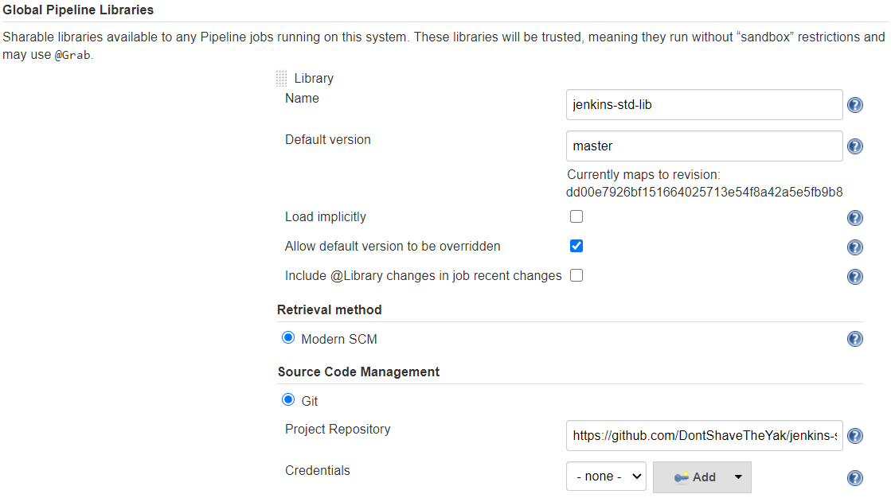

[![Tests][test-badge]][test-url]
[![Lint][lint-badge]][test-url]
[![Latest][doc-badge]][doc-url]

DontShaveTheYak presents the Jenkins Standard Library. A set of useful tools for every day CI/CD jobs.

Why use our library?
* [Less Yak Shaving](https://seths.blog/2005/03/dont_shave_that/) for your team.
* We fully [test][test-url] and [lint][test-url] this codebase.
* Our [Releases][releases-url] and [Docs][doc-url] are automated.
* OpenSource and [Free to use](https://choosealicense.com/licenses/gpl-3.0/).

[](https://www.jenkins.io/)

## Installation

First you need to configure your Jenkins with our Shared Library. In the Jenkins configure page scroll down
until you reach "Global Pipeline Libraries". This is where you can configure what you want to name the library, which version
to use, and the url to reach it.



*Note: Default version of master will get you the latest release. For production you should pin Default version to a [release][releases-url] tag.*

For more detailed information see the offical Jenkins [Shared Library](https://www.jenkins.io/doc/book/pipeline/shared-libraries/) documentation.

### Recommended Setup

Our Shared Library will function and look its best if you setup the additional plugins below. We currently only support Agents that use Linux.

We recommend the following plugins:
* [simple-theme-plugin](https://plugins.jenkins.io/simple-theme-plugin/) - To remove non-useful information from build console. Use this config:

  ```
  .pipeline-annotated {
     display: none;
  }
  .pipeline-new-node {
        display: none;
  }
  ```
* [AnsiColor](https://plugins.jenkins.io/ansicolor/) - To get color coded log messages from our logging package.

The required plugins and versions to enable complete library functionality can be found in [lib-plugins.txt](./docker/lib-plugins.txt).

*Note: Individual library functions may have their own requirements. See the [docs][doc-url]*

### Usage

Once you have installed our shared library you just need to reference it at the top of any jobs.
```
@Library('jenkins-std-lib')
```

For full javadoc documentation see [here][doc-url]. To see example Jenkinsfile's check out the [job](./jobs) directory.

## License
This project is licensed as `GNU General Public License v3.0` see [LICENSE.md](LICENSE.md).

License [attribution](https://app.fossa.com/reports/86d307a0-2efa-4fd9-b983-3fd9382433e0) for depenencies.

[](https://app.fossa.com/projects/custom%2B25932%2Fgithub.com%2FDontShaveTheYak%2Fjenkins-std-lib?ref=badge_large)

[test-badge]: https://img.shields.io/github/workflow/status/DontShaveTheYak/jenkins-std-lib/Tests/master?label=Tests
[lint-badge]: https://img.shields.io/github/workflow/status/DontShaveTheYak/jenkins-std-lib/Tests/master?label=Lint
[test-url]: https://github.com/DontShaveTheYak/jenkins-std-lib/actions/workflows/test.yml
[doc-badge]: https://javadoc.io/badge2/io.github.dontshavetheyak/jenkins-std-lib/javadoc.svg?cacheSeconds=3600
[doc-url]: https://javadoc.io/doc/io.github.dontshavetheyak/jenkins-std-lib
[releases-url]: https://github.com/DontShaveTheYak/jenkins-std-lib/releases
