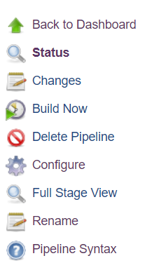

[](https://javadoc.io/doc/io.github.dontshavetheyak/jenkins-std-lib)

DontShaveTheYak presents the Jenkins Standard Library. A set of useful tools for everyday CI/CD jobs.

Why use our library?
* [Less Yak Shaving](https://seths.blog/2005/03/dont_shave_that/) for your team.
* We fully test and lint this codebase.
* Our Releases and Docs are automated.
* OpenSource and Free to use.

[](https://www.jenkins.io/)

## Installation

First you need to configure your Jenkins with our Shared Library. In the Jenkins configure page scroll down
until you reach "Global Pipeline Libraries". This is where you can configure what you want to name the library, which version
to use, and the url to reach it.


*Note: Default version of master will get you the latest release. For production you should pin version to a [release](https://github.com/DontShaveTheYak/jenkins-std-lib/releases) tag.*

The Jenkins Standard Library requires the following plugins:
* AnsiColor - Used to provide color output for our built in logger.

For more detailed information see the offical Jenkins [Shared Library](https://www.jenkins.io/doc/book/pipeline/shared-libraries/) documentation.

### Recommended Setup

Our Shared Library will function and look its best if you setup the additional plugins below.

We recommend the following plugins:
* [simple-theme-plugin](https://plugins.jenkins.io/simple-theme-plugin/) - To remove non-useful information from build console. Use this config:  

  ```
  .pipeline-annotated {
     display: none; 
  }
  .pipeline-new-node {
        display: none; 
  }
  ```
* [OWASP Markup Formatter](https://plugins.jenkins.io/antisamy-markup-formatter/) - To properly render Global Variable documentation. Make sure to enable "Safe HTML" in the "Configure Global Security" page.

### Usage

Once you have installed our shared library you just need to reference it at the top of any jobs.
```
@Library('jenkins-std-lib')
```

Once the job has run once succesfully you can find the documentation for any global vars added by jenkins-std-lib in the "Global Variables Reference" page
of "Pipeline Syntax".



We also have some classes you can import as well. For full documentation see [here](https://javadoc.io/doc/io.github.dontshavetheyak/jenkins-std-lib/latest/index.html).
